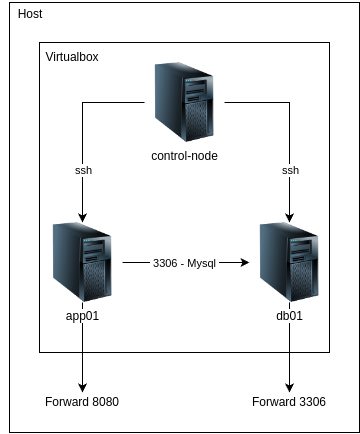

## Ansible: Uma Ferramenta Essencial para Automação de TI

**O que é Ansible?**

Ansible é uma plataforma de automação de TI de código aberto, radicalmente simples, que torna seus aplicativos e sistemas mais fáceis de implantar e manter. Ele automatiza tudo, desde implantação de código até configuração de rede e gerenciamento de nuvem, em uma linguagem que se aproxima da linguagem natural, usando SSH, sem a necessidade de instalar agentes nos sistemas remotos.

**Como o Ansible funciona?**

* **Playbooks:** São arquivos em YAML que descrevem a configuração desejada dos seus sistemas. Eles são como receitas, detalhando passo a passo o que você quer que o Ansible faça.
* **Módulos:** São pequenos scripts que executam tarefas específicas, como instalar pacotes, copiar arquivos ou reiniciar serviços. Os playbooks usam esses módulos para realizar as ações desejadas.
* **Inventário:** É uma lista dos hosts que você deseja gerenciar. O Ansible usa o inventário para saber quais máquinas devem executar os playbooks.

**Vantagens do Ansible:**

* **Simplicidade:** A sintaxe do Ansible é muito intuitiva, o que facilita a criação de playbooks mesmo para usuários com pouco conhecimento de programação.
* **Agentes:** Não é necessário instalar nenhum agente nos hosts, o que reduz a complexidade e a sobrecarga.
* **Idempotência:** As tarefas do Ansible são idempotentes, o que significa que podem ser executadas várias vezes sem causar efeitos colaterais indesejados.
* **Comunidade:** O Ansible possui uma grande comunidade ativa, o que garante um bom suporte e a disponibilidade de diversos módulos e recursos.
* **Extensibilidade:** O Ansible pode ser facilmente estendido com novos módulos e plugins.

**Exemplos de uso:**

* **Provisionamento de servidores:** Crie novos servidores em nuvem com as configurações desejadas, incluindo sistema operacional, software e configurações de rede.
* **Configuração de sistemas:** Configure sistemas operacionais, aplicativos e serviços de forma consistente em vários hosts.
* **Implantação de aplicações:** Implante e configure aplicações em ambientes de produção de forma rápida e segura.
* **Orquestração:** Coordine tarefas complexas em vários hosts, como atualizações de software ou migrações de dados.

**Resumo:**

Ansible é uma ferramenta poderosa e flexível para automatizar tarefas de TI. Sua simplicidade, idempotência e grande comunidade o tornam uma escolha popular para empresas de todos os tamanhos. Se você está procurando uma maneira de reduzir a carga de trabalho manual e melhorar a consistência dos seus sistemas, o Ansible é uma ótima opção.

**Para saber mais:**

* **Documentação oficial:** https://docs.ansible.com/
* **Repositório no GitHub:** https://github.com/ansible/ansible

**Gostaria de ver um exemplo prático de um playbook? Ou talvez você tenha alguma dúvida específica sobre o Ansible?**

**Possíveis tópicos para explorarmos:**

* **Instalação do Ansible**
* **Criação de um inventário**
* **Escrevendo playbooks básicos**
* **Utilizando módulos comuns**
* **Gerenciando múltiplos ambientes**
* **Integração com outras ferramentas**

# Installing Ansible on Ubuntu

Ubuntu builds are available in a [PPA here](https://launchpad.net/~ansible/+archive/ubuntu/ansible).

To configure the PPA on your system and install Ansible run these commands:

```shell
sudo apt update
sudo apt install software-properties-common
sudo add-apt-repository --yes --update ppa:ansible/ansible
sudo apt install ansible
```

## Em caso de erro na instalação:

O sistema operacional informa que você corre o risco de danificar seu sistema.

```shell
pipx install some-python-application
```


# Diagrama do Projeto

Esse projeto monta o esquema abaixo.



# Acessando a máquina control-node

Para verificar os exemplos de configuração de host, acessar `cd control-node && vagrant ssh`.

Dentro da máquina virtual `control-node`, executar: `cat /etc/ansible/hosts`.

# Configurando o control-node

Entrar na máquina `control-node`:

```shell
cd control-node && vagrant ssh
```

Ajustar os hosts:

```shell
sudo vi /etc/ansible/hosts
```

Adicionar a configuração no início:

```properties
[apps]
app01
[dbs]
db01
```

Validar também o host:

```shell
cat /etc/hosts
```

Pingando em todos os hosts:

```shell
ansible -m ping all
```

Se deu erro, é preciso criar as chaves privadas e públicas ssh. Vamos gerar essa chave:

```shell
cd .ssh
ssh-keygen
```

Criado a chave, obter o conteúdo para ser adicionado no provision.sh das outras máquinas.

```shell
cat id_ed25519.pub

$ ssh-ed25519 AAAAC3NzaC1lZDI1NTE5AAAAIHxlyJXvUuz4qu1DHBDd4HRQcghhYmX1M6J65w6bEXG2 vagrant@control-node
```

## Ao usar o provision do control-node

Verificar o `hosts`, pois podem haver duplicidade.

```shell
cat /etc/hosts
```

# Playbooks

Um playbook no Ansible é como uma receita para configurar e gerenciar seus servidores. Ele define um conjunto de tarefas a serem executadas em um ou mais hosts.

### Estrutura Básica de um Playbook

Um playbook é um arquivo em formato YAML, que é fácil de ler e escrever. A estrutura básica de um playbook inclui:

- **Nome**: Um nome descritivo para o playbook.
- **Hosts**: Uma lista dos hosts onde as tarefas serão executadas.
- **Tasks**: Um conjunto de tarefas a serem realizadas.
http://localhost:8080/
cd /vagrant
```

Como ele está mapeando a pasta raiz, acessar:

```shell
cd playbooks
```

### Instalando o mysql na máquina db01

**Primeiro** instalar o book do mysql:

```shell
ansible-galaxy install geerlingguy.mysql
```

Executar o playbook:

```shell
ansible-playbook db.yml
```

### Adicioando o app na máquina app01

Executar o playbook:

```shell
ansible-playbook app.yml
```

# Aplicação

Só acessar [http://localhost:8080/](http://localhost:8080/)