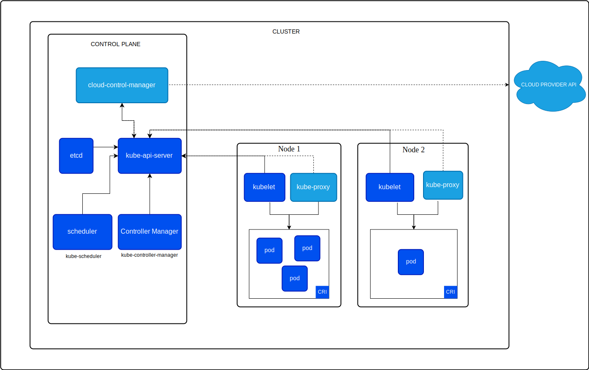

# Kubernetes (K8s) 

É uma plataforma de código aberto para orquestração de contêineres, que automatiza o processo de implantação, escalonamento e gerenciamento de aplicações conteinerizadas. Ele foi originalmente desenvolvido pelo Google e agora é mantido pela Cloud Native Computing Foundation (CNCF). O Kubernetes abstrai a infraestrutura subjacente e fornece uma plataforma para executar aplicações distribuídas com alta disponibilidade e resiliência.



## Principais Componentes:

1. **Cluster**: Conjunto de nós (máquinas físicas ou virtuais) onde o Kubernetes gerencia a aplicação.
2. **Master (Control Plane)**: Composto de vários componentes que controlam e gerenciam o cluster:
    - **API Server**: Ponto de entrada para todas as operações.
    - **etcd**: Armazena todos os dados de configuração do cluster.
    - **Controller Manager**: Executa os controladores, como o de replicação, que mantém o número desejado de réplicas de um pod.
    - **Scheduler**: Aloca os pods nos nós com base nos requisitos de recurso e restrições.
3. **Worker Nodes**: Hospedam os Pods, que são as menores unidades de implantação, consistindo em um ou mais contêineres.
4. **Kubelet**: Agente que roda em cada nó e garante que os contêineres dentro dos pods estejam rodando.
5. **Kube-proxy**: Mantém as regras de rede no nó para comunicação de rede dos pods.

## Principais Vantagens:

1. **Escalabilidade Automática**: O Kubernetes permite escalar automaticamente as aplicações com base na demanda (Horizontal Pod Autoscaler).
2. **Auto-recuperação**: Detecta falhas em containers e reinicia automaticamente para manter as aplicações em funcionamento.
3. **Distribuição de Carga**: Garante que o tráfego seja distribuído igualmente entre as instâncias das aplicações (serviços Load Balancer e Ingress).
4. **Implementação Contínua**: Facilita rolling updates e rollbacks, permitindo a atualização sem downtime.
5. **Portabilidade**: Suporta qualquer infraestrutura, seja local (on-premise) ou na nuvem.
6. **Isolamento**: Cada aplicação roda em seu próprio ambiente de contêiner isolado, o que aumenta a segurança.

# Os principais conceitos do Kubernetes

Os principais conceitos do Kubernetes são essenciais para entender seu funcionamento e como ele gerencia aplicações conteinerizadas de forma distribuída. Aqui estão os conceitos fundamentais:

1. **Cluster**
    - Um cluster Kubernetes é composto por um conjunto de nós (máquinas físicas ou virtuais) que executam as aplicações conteinerizadas. O cluster é dividido em dois tipos de nós:
      - **Control Plane (Plano de Controle)**: Onde o gerenciamento central acontece.
      - **Worker Nodes (Nó de Trabalho)**: Onde as aplicações (pods) são executadas.
2. **Node**
    - Um nó é uma máquina no cluster (física ou virtual) onde os pods são executados. Cada nó tem os componentes necessários para rodar e gerenciar containers.
3. **Pod**
    - A menor unidade de execução no Kubernetes. Um pod pode conter um ou mais contêineres, que compartilham o mesmo espaço de rede e armazenamento. É uma abstração que representa uma aplicação ou parte dela.
4. **Service**
    - Um Service é uma abstração que define uma maneira estável de expor uma aplicação executando em um pod para outras aplicações ou para o mundo externo. Ele oferece um endpoint IP único e equilibrado para os pods.
5. **Namespace**
    - Um namespace é uma maneira de dividir e isolar recursos dentro de um cluster Kubernetes. Ele permite que várias equipes ou projetos compartilhem o mesmo cluster de forma segura e eficiente.
6. **ReplicaSet**
    - Um ReplicaSet garante que um número específico de réplicas de um pod esteja rodando em um determinado momento. Se um pod falhar, o ReplicaSet criará automaticamente outro para manter a contagem.
7. **Deployment**
    - Um Deployment gerencia a implementação de pods e ReplicaSets. Ele permite atualizar, escalar e gerenciar de forma mais simples os pods. Também facilita rollbacks e rolling updates.
8. **ConfigMap e Secret**
    - **ConfigMap**: Armazena dados de configuração não sensíveis (como arquivos de configuração) que podem ser injetados nos contêineres.
    - **Secret**: Armazena dados sensíveis (como senhas e chaves) que são gerenciados de forma segura e também injetados nos contêineres.
9. **Ingress**
    - Um Ingress gerencia o acesso externo aos serviços em um cluster, normalmente via HTTP e HTTPS. Ele fornece um ponto de entrada unificado, incluindo balanceamento de carga e roteamento baseado em regras.
10. **Volume e PersistentVolumeClaim (PVC)**
    - **Volume**: Abstração de armazenamento que pode ser anexada a um pod. Diferente do armazenamento no contêiner, os volumes são persistentes.
    - **PersistentVolume (PV) e PersistentVolumeClaim (PVC)**: PV representa armazenamento persistente no cluster. PVC é um pedido de armazenamento feito por um pod.
11. **Horizontal Pod Autoscaler (HPA)**
    - O HPA ajusta automaticamente o número de réplicas de pods com base na utilização de recursos, como CPU ou memória. Ele ajuda a escalar as aplicações conforme necessário.
12. **DaemonSet**
    - Um DaemonSet garante que um pod seja executado em cada nó do cluster. Ele é útil para tarefas comuns de infraestrutura, como monitoramento ou coleta de logs.
13. **StatefulSet**
    - Um StatefulSet gerencia pods que precisam de identidade estável e armazenamento persistente, normalmente usados para aplicações com estado (bancos de dados, por exemplo).
14. **Job e CronJob**
    - **Job**: Garante que um ou mais pods sejam executados até a conclusão de uma tarefa.
    - **CronJob**: Executa jobs em intervalos de tempo especificados (semelhante ao cron do Linux).
15. **Controller**
    - Controllers são loops de controle que monitoram o estado atual do cluster e garantem que ele corresponda ao estado desejado, como garantir que o número correto de pods esteja rodando.

# Usando o Vagrant

Para configurar e montar um cluster Kubernetes em uma máquina virtual usando o Vagrant e o provisionamento automatizado, você pode criar um **Vagrantfile** que define a máquina virtual, instala os pré-requisitos e configura o Kubernetes. Vamos criar um exemplo de como você pode fazer isso no **Vagrant** usando um provisionamento básico em Bash.

## Exemplo de Vagrantfile para montar um cluster Kubernetes com kubeadm:

### 1. Instalar o Vagrant e VirtualBox
Antes de começar, certifique-se de ter o Vagrant e o VirtualBox instalados.:

- Vagrant
- VirtualBox

### 2. Criar o Vagrantfile
Crie uma pasta para o seu projeto, e dentro dessa pasta crie um arquivo chamado `Vagrantfile`. O exemplo está nesse projeto.

#### Explicação:

1. **Box**: A box usada é o ubuntu/focal64, que é o Ubuntu 20.04.
2. **Recursos da VM**: A máquina virtual terá 2 GB de RAM e 2 CPUs. Você pode ajustar esses valores conforme necessário.
3. **Provisionamento**:
   - **Desativação do Swap**: Kubernetes exige que o swap esteja desativado.
   - **Instalação do Docker**: Docker é instalado como o runtime de contêiner.
   - **Instalação do Kubernetes (kubeadm, kubelet, kubectl)**: São instalados para iniciar o cluster Kubernetes.
   - **Inicialização do Control Plane**: kubeadm init é usado para configurar o nó mestre.
   - **Instalação do Flannel**: O Flannel é um plugin de rede para permitir comunicação entre os pods.

### 3. Executar o Vagrant
Na mesma pasta onde você criou o Vagrantfile, execute:

```shell
vagrant up
```

Isso iniciará a máquina virtual, instalará o Docker, Kubernetes, e configurará o cluster Kubernetes automaticamente.

### 4. Verificar o Cluster Kubernetes
Após a máquina ser provisionada, você pode acessar a máquina virtual usando:

```shell
vagrant ssh
```

Dentro da máquina, verifique o status do cluster:

```shell
kubectl get nodes
```

Se tudo estiver correto, você verá o nó listado como Ready.

### 5. Adicionar Nós de Trabalho (Opcional)

Se quiser adicionar mais nós ao cluster, você pode duplicar e modificar o `Vagrantfile` para criar mais VMs e usar o comando `kubeadm join` fornecido ao final do processo de inicialização do master.

### 6. Encerrar ou Destruir a Máquina
Para desligar a máquina:

```bash
vagrant halt
```

Para destruir a máquina e remover todos os recursos:
```bash
vagrant destroy
```

### Observação:

Se o auto completar do `kubectl` não funcionar, tente acessar o vagrant via ssh e execute:

```shell
sudo apt-get install bash-completion -y
echo 'source <(kubectl completion bash)' >>~/.bashrc
echo 'alias k=kubectl' >>~/.bashrc
echo 'complete -o default -F __start_kubectl k' >>~/.bashrc
source ~/.bashrc
```

# Execute os comando o kubernetes sempre como sudo:

```shell
sudo su -
```

Teste o comando abaixo:

```shell
kubectl get nodes
```
Saída:
```shell
NAME          STATUS   ROLES           AGE     VERSION
manager-k8s   Ready    control-plane   4m50s   v1.31.1
```

# Acessando o docker do estudos anteriores

O kubernete precisará acessar dockers externos, no caso na mesma máquina de estudo. Para isso, usando `ifconfig`, descobri o IP minha máquina `192.168.0.160`. Assim, o virtualbox consegue acessar máquinas externas.


# Instalando o rancher

No ssh do vagrant, como `sudo su -`. O Rancher usamos o docker. O comando abaixo cria o container dele:

```shell
sudo docker run --privileged -d --restart=unless-stopped --name rancher-docker -p 8888:80 -p 4444:443 rancher/rancher
```

Para acessa: [localhost:4444/dashboard/account](https://localhost:4444/dashboard/account).

### Outros comandos úteis

Exibir todos os pod:

```shell
kubectl get pods --all-namespaces
```

Exibir por namespaces:

```shell
kubectl get pods -n cattle-system
```

Logs por pod:
```shell
kubectl logs rancher-5f87b99fdf-cpz6f -n cattle-system
```

Dados dos pods e deployment:

```shell
kubectl get pod rancher-5f87b99fdf-cpz6f -n cattle-system -o jsonpath='{.spec.containers[*].name}'
kubectl get deployment rancher -n cattle-system
kubectl describe deployment rancher -n cattle-system
kubectl describe pod rancher-5f87b99fdf-cpz6f -n cattle-system
```

Exibir todos os deplyments:

```shell
kubectl get deployment -n cattle-system
```

Reinicinado um deployment:

```shell
kubectl rollout restart deployment rancher -n cattle-system
```

